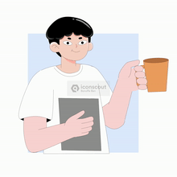

# Hi 👋, I'm Aiden Ramsey

### Computer Science & Mathematics Student

 

## ☕ About Me

- 🔭 I'm currently working on **games that implement C#**
- 🌱 I'm currently learning **C# OOP principles**
- 👯 I'm looking to collaborate on **open source projects, games, and scripting**
- 💬 Ask me about **game development & full-stack development**
- 📫 How to reach me: **aidenramsey06@gmail.com**
- ⚡ Fun fact: **I like hiking in the Ozark Mountains and I love starting my day off with coffee**
- 📄 Know about my experiences: **[My Resume](https://docs.google.com/document/d/1r_wFcGzel9xKSjd02jx8nVToBjdJerIztuBZWR9XYhM/edit?usp=share_link)**

 

## 🤝 Connect with me

&nbsp;&nbsp;

&nbsp;&nbsp;

&nbsp;&nbsp;

## 🛠️ Languages and Tools

&nbsp;

&nbsp;

&nbsp;

&nbsp;

&nbsp;

&nbsp;

&nbsp;

&nbsp;

## 📊 GitHub Stats

